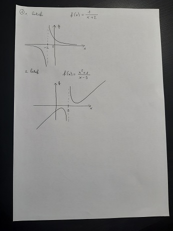
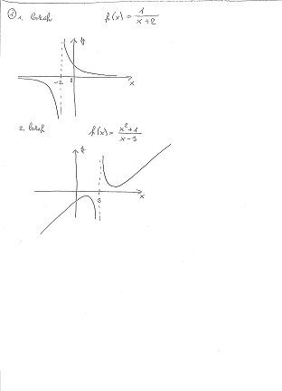

# Document Scanner

Simple CLI application for scanning documents from images. This application is build around algorithm proposed by Adrian Rosebrock [[1]](https://www.pyimagesearch.com/2014/09/01/build-kick-ass-mobile-document-scanner-just-5-minutes/) and uses OpenCV's adaptive thresholding [[2]](https://docs.opencv.org/4.5.2/d7/d4d/tutorial_py_thresholding.html) for scanner-like look of the output images.

_Source image on the left is converted into the output image on the right._

## Usage

To use Document Scanner you need to have Python installed with all the required packages as specified in `requirements.txt`. Run
    
    $ pip install -r requirements.txt

Then you can run the script by calling

    $ python scanner.py <arguments>

There are several arguments that have to be specified for successful execution of the program. You need to specify the format of the program output. You can choose between

1. `-v`, this option only displays the output images. Additionaly to this option you can optionally specify
    - `-t <integer>`, target height of the displayed images on screen;
    
2. `-p <filename>`, this option creates a `.pdf` with specified `<filename>` (note that the name must have the `.pdf` extension). If you want you can optionally specify dimensions of the images in the generate file with
    - `-d <integer> <integer>`, defaults for these options are numbers `210` and `297` (dimensions of A4 paper);
    
3. `-i <dirname>`, this option generates individual images in directory `<dirname>`.

For all the options you can specify the `-s <integer1> <integer2>` which will apply post-processing effects to make the document look more like if it was scanned by conventional document scanner. Numbers `<integer1>` and `<integer2>` can either be zeros. This will cause the output images to be converted to grayscale. Or they can be positive and be used as arguments to the adaptive thresholding. First number stands for block size, second is constant `c`. Good results are obtained with numbers `11` and `10`.

Then you have to specify at least one `<filename>` of input image.

Full call of the script can look like this

    $ python scanner.py -p out/test.pdf -s 11 10 data/1.jpg data/2.jpg

Keep in mind that the command line arguments will likely change in future versions.

## Development

This project is still in development. Future goals are

1. Better post-processing of the output images;

2. Plain-text output.
   
## Reference

[1] [Building Mobile Document Scanner by Adrian Rosebrock](https://www.pyimagesearch.com/2014/09/01/build-kick-ass-mobile-document-scanner-just-5-minutes/)

[2] [Adaptive Thresholding](https://docs.opencv.org/4.5.2/d7/d4d/tutorial_py_thresholding.html)